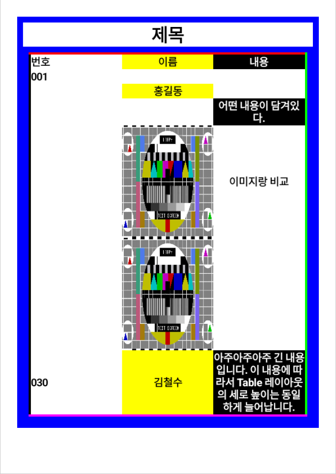

# AndroidPdfWriter
[](https://maven-badges.herokuapp.com/maven-central/io.github.hangyeolee/androidpdfwriter) [](https://android-arsenal.com/api?level=14)

Easy PDF Library for Android.
- [한국어 README.md](./README-ko.md)

## Table of Contents
0. [v1.1.0](#v1.1.0)
1. [Setup](#setup)
   1. [Gradle Setup](#gradle-setup)
   2. [Maven Setup](#maven-setup)
2. [Quick Start](#quick-start)
3. [Example Image](#example-image)
4. [Description](#description)
5. [License](#license)

## v1.1.0
The existing version draws the components shown on each page on a bitmap.
The disadvantage of this method is that the app could bounce due to out of memory from the moment the canvas size exceeded five pages.

Starting with version 1.1.0, all components are converted to PDF binary format.
That is, the capacity of the output PDF file is reduced by optimizing text and images in binary format.

Embedding fonts are only supported for the `.ttf` extension.

## Setup
The snapshot repository must be added first.
### Gradle Setup
``` gradle
dependencies {
  implementation 'io.github.hangyeolee:androidpdfwriter:1.1.0'
}
```

### Maven Setup
``` xml
<dependency>
    <groupId>io.github.hangyeolee</groupId>
    <artifactId>androidpdfwriter</artifactId>
    <version>1.1.0</version>
</dependency>
```

## Quick Start
``` Java
// The parameters of the PDF Builder are horizontal and vertical lengths based on 72 dpi.
// A4 paper width:595.3px height:841.9px
PDFBuilder builder = new PDFBuilder(Paper.A4);

// set PDF page padding, vertical and horizontal
builder.setPagePadding(30, 30);
```

#### this is test pdf page:
``` Java
builder.root = PDFLinearLayout.build(Orientation.Vertical)
        .setBackgroundColor(Color.BLUE)
        .addChild(PDFImage.fromResource(context, resourceId)
                .setCompress(true)
                .setHeight(200f)
                .setFit(Fit.CONTAIN))
        .addChild(PDFH1.build("Title", PDFFont.HELVETICA_BOLD)
                .setBackgroundColor(Color.RED)
                .setTextAlign(TextAlign.Center))
        .addChild(PDFGridLayout.horizontal(3)
                .setMargin(10, 10, 10, 10)
                .setBackgroundColor(Color.WHITE)
                .setBorder(border -> border
                        .setLeft(4, Color.BLACK)
                        .setTop(4, Color.RED)
                        .setRight(4, Color.GREEN)
                        .setBottom(4, Color.MAGENTA))
                .addCell(PDFH3.build("Number").wrapGridCell())
                .addCell(PDFH3.build("Name")
                        .setFontFromAsset(context, "Pretendard-Bold.ttf")
                        .setBackgroundColor(Color.YELLOW)
                        .setTextAlign(TextAlign.Center)
                        .wrapGridCell())
                .addCell(PDFH3.build("Content")
                        .setBackgroundColor(Color.BLACK)
                        .setTextColor(Color.WHITE)
                        .setTextAlign(TextAlign.Center)
                        .wrapGridCell())
                .addCell(1, 0, PDFH3.build("001")
                        .setBackgroundColor(Color.GREEN)
                        .wrapGridCell()
                        .setBackgroundColor(Color.BLACK))
                .addCell(2, 1, PDFH3.build("Hong Gil-Dong")
                        .setBackgroundColor(Color.YELLOW)
                        .setTextAlign(TextAlign.Center)
                        .wrapGridCell()
                        .setBackgroundColor(Color.BLACK))
                .addCell(3, 2, PDFH3.build("Some content had been existed.")
                        .setBackgroundColor(Color.BLACK)
                        .setTextColor(Color.WHITE)
                        .setTextAlign(TextAlign.Center)
                        .wrapGridCell()
                        .setBackgroundColor(Color.GREEN))
                .addCell(4, 1, PDFImage.fromResource(context, resourceId)
                        .setCompress(true)
                        .setHeight(150)
                        .setFit(Fit.CONTAIN)
                        .wrapGridCell())
                .addCell(4, 2,  PDFH3.build(
                        "It's a very, very long content, and the vertical height of the table layout is the same. It's a very, very long content, and the vertical height of the table layout is the same.")
                        .setTextColor(Color.BLACK)
                        .setTextAlign(TextAlign.Center)
                        .wrapGridCell()))
        .addChild(PDFGridLayout.horizontal(2)
                        .setMargin(10, 10, 10, 10)
                        .setBackgroundColor(Color.WHITE)
                        .setBorder(border -> border
                                .setLeft(4, Color.BLACK)
                                .setTop(4, Color.RED)
                                .setRight(4, Color.GREEN)
                                .setBottom(4, Color.MAGENTA))
                .addCell(0, 0, PDFH3.build(
                                "It's a content without Span.")
                        .setBackgroundColor(Color.BLACK)
                        .setTextColor(Color.WHITE)
                        .setTextAlign(TextAlign.Center)
                        .wrapGridCell())
                .addCell(1, 0, PDFH3.build(
                                "It's a content without Span.")
                        .setBackgroundColor(Color.WHITE)
                        .setTextColor(Color.BLACK)
                        .setTextAlign(TextAlign.Center)
                        .wrapGridCell())
                .addCell(0, 1, PDFH3.build(
                                "It's a very long content. According to this content, the vertical height of Table layout is the same. It also has Span applied, and if you do well, you can also go over the page.")
                        .setBackgroundColor(Color.BLACK)
                        .setTextColor(Color.WHITE)
                        .setTextAlign(TextAlign.Center)
                        .wrapGridCell()
                        .setRowSpan(2))
                .addCell(2, 0, PDFH3.build(
                                "PDFH3 It's a very long content. According to this content, the vertical height of Table layout is the same. It also has Span applied, and if you do well, you can also go over the page.")
                        .setBackgroundColor(Color.BLACK)
                        .setTextColor(Color.WHITE)
                        .setTextAlign(TextAlign.Center)
                        .wrapGridCell()
                        .setRowSpan(2))
                .addCell(2, 1, PDFH3.build(
                                "PDFH3 It's a content without Span.")
                        .setBackgroundColor(Color.GRAY)
                        .setTextColor(Color.WHITE)
                        .setTextAlign(TextAlign.Center)
                        .wrapGridCell())
                .addCell(3, 1, PDFH3.build(
                                "PDFH3 It's a content without Span.")
                        .setBackgroundColor(Color.RED)
                        .setTextColor(Color.WHITE)
                        .setTextAlign(TextAlign.Center)
                        .wrapGridCell()))
;
```

#### When you want to save a created file:
``` Java
builder.draw();
// Saved in the Download folder.
builder.save(context, StandardDirectory.DIRECTORY_DOWNLOADS, "result.pdf");
```

## Example Image
#### PDF File looks like below:




## Description
Sets the quality value for the image within the PDF. Can change compress quality. Default quality is `85`.
``` Java
builder.setQuality(60);
```

DPI adjustment is not possible with binary optimization. Deleted method.
``` Java
/**
* Deleted. not deprecated.
*/
builder.setDPI(DPI.M5);
```

The larger the padding of the page that is not related to PDFComponents, the smaller the maximum width and height of the components. Default Padding is `(0, 0)`. In case of printing, it is recommended to add about `(30, 30)` padding.
``` Java
builder.setPagePadding(30, 30);
```

## License
Copyright 2023 HanGyeol Choi

Licensed under the Apache License, Version 2.0 (the "License"); you may not use this file except in compliance with the License. You may obtain a copy of the License at

> http://www.apache.org/licenses/LICENSE-2.0

Unless required by applicable law or agreed to in writing, software distributed under the License is distributed on an **"as is" basis, without warranties or conditions of any kind**, either express or implied. See the License for the specific language governing permissions and limitations under the License.
